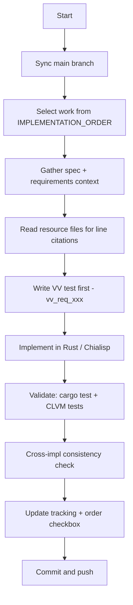

# Prompt entry (chia-l2-consensus)

The operator decision tree starts at **[`start.md`](start.md)**.

Use this file for:

- Choosing work from [`IMPLEMENTATION_ORDER.md`](../requirements/IMPLEMENTATION_ORDER.md) (or ad-hoc tasks)
- Tracing **requirement ID → NORMATIVE → dedicated spec → VERIFICATION / TRACKING**
- Gathering context from resource files in [`docs/resources/`](../resources/)
- Cross-implementation consistency between **Rust** and **Chialisp**

**Flat outline**

| Step | Page |
|------|------|
| Start | [`start.md`](start.md) |
| Tree index | [`tree/README.md`](tree/README.md) |
| Git | [`tree/dt-git.md`](tree/dt-git.md) |
| Select work | [`tree/dt-wf-select.md`](tree/dt-wf-select.md) |
| Gather context | [`tree/dt-wf-gather-context.md`](tree/dt-wf-gather-context.md) |
| Test first | [`tree/dt-wf-test.md`](tree/dt-wf-test.md) |
| Implement | [`tree/dt-wf-implement.md`](tree/dt-wf-implement.md) |
| Validate | [`tree/dt-wf-validate.md`](tree/dt-wf-validate.md) |
| Update tracking | [`tree/dt-wf-update-tracking.md`](tree/dt-wf-update-tracking.md) |
| Commit | [`tree/dt-wf-commit.md`](tree/dt-wf-commit.md) |

Go to [`start.md`](start.md).
